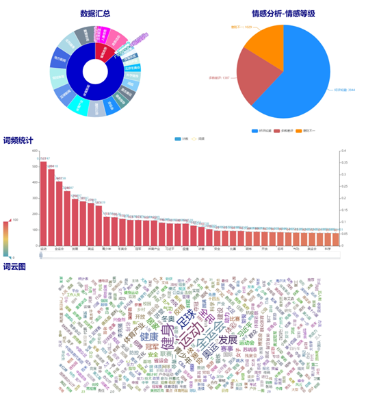

# 体育局官网新闻标题爬取、数据存储、分析与可视化

本项目为数据库系统与数据仓库实训课程作业，上传以作记录。

## 一、需求分析

### 1.1爬虫需求

爬虫需要爬取广东市体育局官网2015（实际是从2008年开始爬取）~至今的新闻资讯及政务公开信息内容。需要的爬取内容有新闻标题与发布时间。

### 1.2数据库（存储）需求

爬取的数据库需要通过Python存入MySQL数据库中，本次创建的数据库为 guangdong_sport_gov。该数据库应具有三张表格，分别为：

1、经过清理后的原始数据表 news，表中应包含每条数据的序列号（id）、标题（title）、发布日期（date）以及所属分类的标签（tag）；

2、由 news 进行词频统计后另存的词频数据表 word_count，表中应包含数据的序列号（id）、经词频统计后的单词（word）、单词总数（count）以及词频（frequency）；

3、由 news 进行情感分析后另存的情感分析数据表emotion_analyse，表中应包含数据的序列号（id）、标题
（title）、情感分析值（emotion_value）以及将分析值离散化后获得的情感等级（emotion_state）；

### 1.3程序需求

首先，程序需要使用爬虫对目标网站的新闻标题和日期进行爬取，并进行初步的数据清洗，如违法字符替换、记录去重、中文繁简转换、字符串格式转换等；

其次，程序需要能够自动连接本地 MySQL，自动创建所需数据库和相应表格，并具有对数据库进行增、删、改、查操作的能力，在将数据保存至数据库的同时，还要将其另存到同名 csv 文件。

最重要的是，程序需要具有对数据库内数据进行分析和可视化的能力，并将生成的可视化结果保存至本地。

最后，程序的编写应该符合规范，注释详细，同时要能够在控制台打印出相应操作和可能会出现的错误，便于程序员/使用者了解程序运行进度及错误的排查。

### 1.4可视化需求

数据的可视化应充分运用色彩、布局等要素，使人可以快速抓住分析结果的要点，同时应具有一定的交互能力。

## 二、设计

### 2.1程序设计

#### 2.1.1用到的库

1、request：用于制作爬虫；

2、pymysql：用于链接数据库；

3、SnowNLP：用于进行情感分析；

4、jieba：用于进行词频统计；

5、pyecharts：可视化。

#### 2.1.2源代码组成及功能

1、main.py：主程序，负责将各个部分组合起来一并执行。

2、web_crawler.py：爬虫程序。主要实现：
	a) 对于有分页的网页进行自动浏览和爬取；
	b) 将爬取到的网页按照元素进行分拣，获得目标信息；
	c) 将爬取到的信息以“页”为单位，以列表形式进行进一步处理和存储。

3、data_save.py：数据存储程序。主要实现：
	a) 将爬虫获取的数据进行规范化；
	b) 将数据存入指定 csv 文件；
	c) 将爬取到的数据存入数据库以便进一步分析。

4、data_analyse.py：数据分析程序。主要实现;
	a) 对爬取到的数据进行词频统计并生成词云图；
	b) 对标题进行情感分析，得出情感状态（正面，中性，负面）并将结果保存至 csv 文件；
	c) 对原始数据表进行汇总，并输出可以作为旭日图参数的字典列表。

5、data_visualization.py：数据可视化程序。主要实现数据的可视化。

6、common_function：前五个.py 文件常用功能，被另外封装以减少重
复代码。

#### 2.1.3优化项

##### 
    已优化

1. 将链接 MySQL 等一系列五大主要.py 文件常使用的功能封装到了common_function.py 中；
2. 将需要爬取的网址及其标签另存至同级目录的 webs.json 中，当所需爬取的网页发生改变时可以直接修改该文件，增加了代码的可复用性（应该）；
3. 编写了用于生成旭日图参数（字典列表）的代码，并将它封装至common_function.generate_dict( )中。可以不用手撸所需的数据（虽然 debug 又花了四五个小时）；

##### 
    待优化

1. 整段代码只能将 csv 文件保存至同级目录中，否则运行会栈区溢出。推测应该是爬取网页时web_crawler.auto_browsing( )递归的层数过多，目前还想不到什么有效减少局部变量来解决该问题的方法。
2. （编写本报告的时候突然想起来）可以将部分函数和全局变量进行类封装，这样更加便于后期拓展。目前的留个.py 文件中的都是一个个函数，没有体现出 Python 作为面向对象语言的优势。
3. data_visualization. data_visualization()需要执行.render()操作生成render.html，在网页中拖拽设计好图表布局之后，点击 save_config按钮保存配置文件，再回到编译器中执行.save_resize_html()*操作（在
   此之前必须要注释掉.render()），才能生成作中的.html 文件，无法通过代码一步完成（也可能是我不知道）。

### 2.2可视化设计

#### 2.2.1本地词云图

在绘制时额外使用了同级目录下的 shouJin.ttf 文件，使得词云字体为瘦金体，看起来更加美观。

#### 2.2.2网页可视化

如上文所示，data_visualization. data_visualization( )使用pyecharts库进行图表绘制，并会将可视化结果生成.html文件，通过浏览器查看。

网页可视化部分分为：数据汇总旭日图、情感分析饼状图、词频统计柱状/折线图和词云图。

交互部分，每张表都设置有鼠标悬停事件（显示由元素具体数量等）。

旭日图在鼠标悬停时，初该元素及其父元素之外的其他元素会有淡化效果，点击该元素可以进入相应节点，查看其子元素更加详细的分布情况。

饼状图在悬停时会有突出效果。

饼状图和柱状/折线图都可以通过图侧的legend来调节元素的显示情况，柱状/折线图还可以通过左侧的范围轴和底部的缩放轴来显示或筛选数据。

## 三、总结

期末的英语作业才吐槽过连肝12个小时的痛，结果这作业就让我连轴转了将近30个小时（精神抖擞）。果然人类的可能性是无穷大的（迫真）。

熬夜写bug总归是痛苦的，但是这次的作业是目前遇到过的综合性最强的作业，也算获益良多了，痛并快乐着吧。

最后祝我身体健康，再见。
